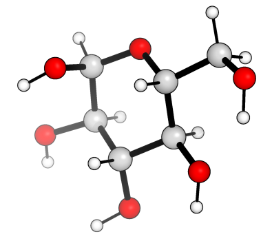
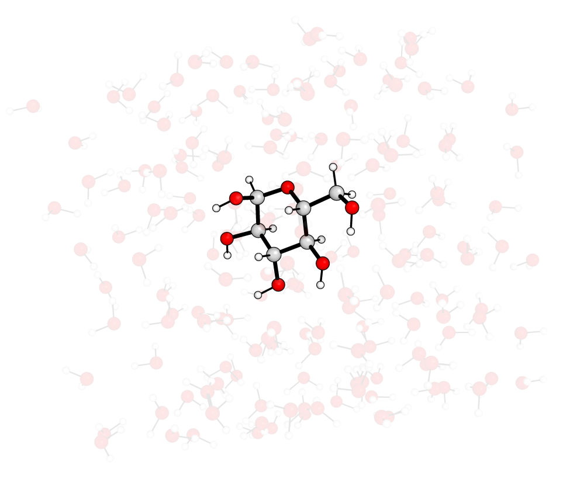
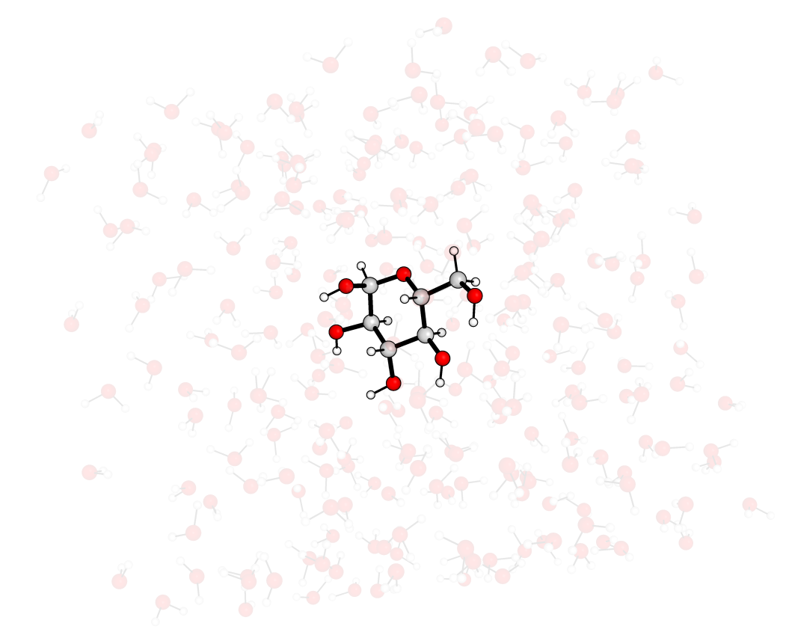
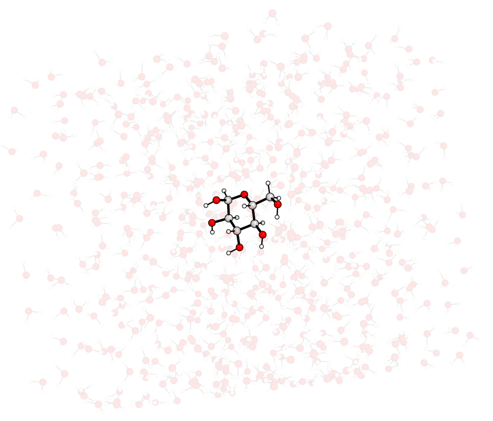

***********************************
Creating solvated molecular systems
***********************************

The solvation functionality in MLPtrain allows you to create solvated molecular systems by placing solute molecules in boxes surrounded by solvent molecules. This is particularly useful for studying chemical processes in explicit solvents.

--------------------------------------
Example: Solvating glucose in water
--------------------------------------

This example demonstrates how to create a solvated structure using glucose as the solute and water as the solvent.

First, let's create a glucose molecule using its SMILES representation and convert it to a Configuration:

.. code-block:: python

   import mlptrain as mlt
   import autode as ade

   # Create glucose molecule from SMILES
   glucose_smiles = "OC[C@H]1OC(O)[C@H](O)[C@@H](O)[C@@H]1O"  # β-D-glucose
   glucose_mol = ade.Molecule(smiles=glucose_smiles)
   
   # Optimize the geometry (optional but recommended)
   glucose_mol.optimise(method=ade.methods.XTB())
   
   # Convert to MLPtrain Molecule and then Configuration
   glucose_config = mlt.Configuration(atoms=glucose_mol.atoms, charge=0, mult=1)

Now we can solvate the glucose molecule using different approaches.

----------------------------------------------
Method 1: Using solvent name from database
----------------------------------------------

The simplest way is to specify the solvent by name. MLPtrain includes a database of common solvents with their densities:

.. code-block:: python

   # Solvate using solvent name
   glucose_config.solvate(solvent_name='water')

This approach:

* Automatically looks up water in the solvent database
* Uses the stored density (1.0 g/cm³ for water)
* Creates and optimizes a water molecule using XTB
* Places water molecules around the glucose

You can also specify additional parameters:

.. code-block:: python

   # Solvate with custom parameters
   glucose_config.solvate(
       solvent_name='water',
       box_size=20.0,          # Box size in Å (if not specified, calculated automatically)
       contact_threshold=2.0,   # Minimum distance between atoms in Å
       random_seed=12345       # For reproducible results
   )
   

or by changing the buffer_distance, which is the distance added to the maximum dimension of
the solute to define the box size:

.. code-block:: python

   # Solvate with custom parameters
   glucose_config.solvate(
       solvent_name='water',          # Box size in Å (if not specified, calculated automatically)
       contact_threshold=2.0,   # Minimum distance between atoms in Å
       buffer_distance=20.0      # Additional buffer distance in Å
   )

The different options will create different box sizes, as can be seen from the images above.

------------------------------------------------------------
Method 2: Using custom solvent molecule and density
------------------------------------------------------------

For more control, you can provide your own solvent molecule and specify its density:

.. code-block:: python

   # Create a custom water molecule
   water_mol = ade.Molecule(smiles="O")
   water_mol.optimise(method=ade.methods.XTB())
   
   # Solvate using custom molecule and density
   glucose_config.solvate(
       solvent_molecule=water_mol,
       solvent_density=1.0,     # Density in g/cm³
       contact_threshold=1.8    # Default contact threshold
   )

This approach is useful when:

* You want to use a pre-optimized solvent geometry
* The solvent is not in the database
* You want to use a non-standard density

---------------------------------------
Understanding the contact threshold
---------------------------------------

The ``contact_threshold`` parameter is crucial for generating realistic solvated structures. It defines the minimum distance (in Å) that atoms are allowed to approach each other during solvent placement.
The number of solvent molecules may be lower than that required for the desired density (which does not take into account the mass of the solute), so by default, the algorithm will try to place as many solvent molecules as possible while respecting the contact threshold.
This threshold affects how tightly the solvent molecules pack around the solute. A smaller threshold results in more solvent molecules being placed, while a larger threshold allows for fewer solvent molecules and more space around the solute.

.. code-block:: python

   # Different contact thresholds
   glucose_config.solvate(
       solvent_name='water',
       contact_threshold=1.5   # Tighter packing - more solvent molecules
   )
   
   glucose_config.solvate(
       solvent_name='water', 
       contact_threshold=2.5   # Looser packing - fewer solvent molecules
   )

**Guidelines for contact_threshold:**

* **1.5-1.8 Å**: Tight packing, suitable for small molecules
* **1.8-2.2 Å**: Default range, works well for most systems  
* **2.2-2.5 Å**: Looser packing, useful for larger or flexible molecules

The algorithm uses a k-d tree with periodic boundary conditions to efficiently check for overlaps and place solvent molecules.

----------------------------------------
Working with the solvated configuration
----------------------------------------

After solvation, you can save and analyze the solvated structure:

.. code-block:: python

   # Save the solvated structure
   glucose_config.save_xyz('glucose_in_water.xyz')
   
   # Check the number of atoms
   print(f"Total atoms in solvated system: {len(glucose_config.atoms)}")
   
   # Check box size
   print(f"Box dimensions: {glucose_config.box.size}")
   
   # The mol_dict tracks different molecule types
   if glucose_config.mol_dict:
       for mol_type, molecules in glucose_config.mol_dict.items():
           print(f"{mol_type}: {len(molecules)} molecules")

You can also use the solvated configuration for further calculations:

.. code-block:: python

   # Use for single point calculations
   glucose_config.single_point(method='xtb')
   
   # Or as part of a machine learning potential training
   system = mlt.System(molecules=[glucose_mlt])
   # Add the solvated configuration to training data...

------------------------------------------
Available solvents in the database
------------------------------------------

MLPtrain includes densities for many common solvents. Some examples include:

* **water**: 1.0 g/cm³
* **methanol**: 0.791 g/cm³  
* **ethanol**: 0.789 g/cm³
* **acetone**: 0.79 g/cm³
* **dichloromethane**: 1.33 g/cm³
* **dmso**: 1.10 g/cm³
* **benzene**: 0.874 g/cm³

For a complete list, check the ``solvent_densities`` dictionary in the configuration module.

-------------------------------
Tips for successful solvation
-------------------------------

1. **Pre-optimize your solute**: Always optimize the solute geometry before solvation for better results.

2. **Choose appropriate box size**: If not specified, the box size is calculated automatically by adding a buffer distance to the maximum molecular dimension.

3. **Adjust contact threshold**: Start with the default (1.8 Å) and adjust based on your system and desired density.

4. **Use random seeds**: Set a ``random_seed`` for reproducible solvation patterns during development.

5. **Check the results**: Always visualize the solvated structure to ensure reasonable geometry.

This solvation functionality provides a robust foundation for creating explicit solvent systems that can be used in machine learning potential training and molecular dynamics simulations.