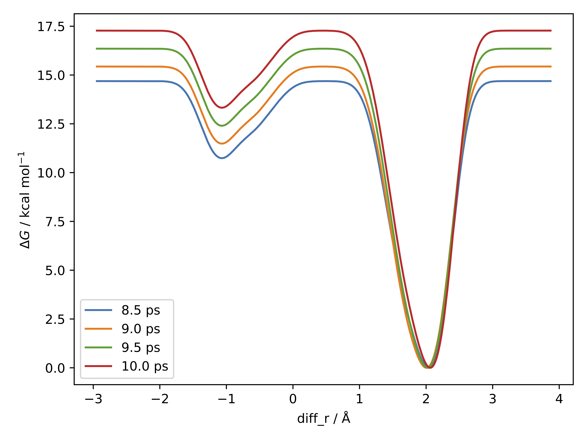
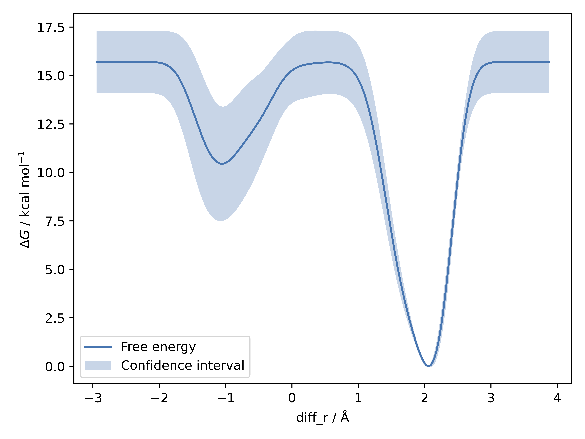

********************************
Run Metadynamics with MLP model
********************************

Once an MLP model is generated, it can be used to run metadynamics simulation, which is supported in mlp-train interfaced with PLUMED (https://www.plumed.org/doc-v2.9/user-doc/html/index).

---------------------------------------------
Part 1: Run a simple metadynamics simulation
---------------------------------------------

This example assumes that you already have an MLP model (e.g. r1_wtmetad.model) and an intial configuration for metadynamics (e.g. ch3cl_f.xyz) in your working directory:

Firstly, the model is loaded by specifying the system and the model:

.. code-block:: python

   import mlptrain as mlt

   system = mlt.System(
       mlt.Molecule("ch3cl_f.xyz", charge=-1, mult=1), box=mlt.Box([100,100,100])
   )

   # a random configuration is generated for later use in the metadynamics simulation 
   config = system.random_configuration()

   mace = mlt.potentials.MACE('r1_wtmetad', system=system)

Second, you need to specify the collective variables and associated parameters (type of collective variables, atom indexes, and restraining potentials, etc. More information could be found in Documentations>References>Sampling). Here is an example using the difference between the C-Cl and C-F bond distance as the CV:

.. code-block:: python

   diff_r = mlt.PlumedDifferenceCV(name="diff_r", atom_groups=((0, 2),(0, 1)))
   #Note: atomic index here is 0-based

Afterwards, we define the auxiliary CV as an average of the :math:`r_{CCl}` and :math:`r_{CF}`.
The attached upper wall bias is located at 2.5 Å, ensuring that when the average bond length passes this value,
it is softly pushed back by a harmonic restraint with a force constant of 1000 eV :math:`\text{Å}^{-2}`.

.. code-block:: python

   avg_r = mlt.PlumedAverageCV(name="avg_r", atom_groups=((0, 1), (0, 2)))
   avg_r.attach_upper_wall(location=2.5, kappa=1000)   

The Plumed bias for these CVs are further set up:

.. code-block:: python

   bias = mlt.PlumedBias(cvs=(diff_r, avg_r)) 

Finally, you can attach the CVs to the metadynamics object and run metadynamics simulation using ``run_metadynamics`` function, specifying the associated parameters, such as width, height (**in eV**) and biasfactor.

.. code-block:: python

   #In this case, diff_r will be biased using metadynamics, and avg_r is an additional CV with WALLS to constrain the system
   metad = mlt.Metadynamics(cvs=diff_r, bias=bias)
   metad.run_metadynamics(
       configuration=config,
       mlp=mace,
       temp=300,
       dt=0.5,
       ps=10,
       interval=10,
       n_runs=3,
       width=0.2,
       height=0.01,
       biasfactor=100,
   )

The free energy profile can also be plotted using

.. code-block:: python

    metad.plot_fes()
    metad.plot_fes_convergence(stride=10, n_surfaces=4)

Here are sample plots:

   Figure: Convergence of the Free Energy Surface (FES) with Simulation Time.

   Figure: Free Energy Profile Along the Reaction Coordinate `diff_r`.

---------------------------------------------------------------------
Part 2: Estimate the width and biasfactor
---------------------------------------------------------------------

You can also estimate the suitable width or biasfactors with the functions ``estimate_width`` or ``try_multiple_biasfactors``, respectively. For width estimation, it works by running some small NVT simulatios, selecting the minimum standard deviation as the optimal width across all simulations for each collective variable. For biasfactor, multiple well-tempered metadynamics runs in parallel with the provided biasfactors and the resulting trajectories are plotted for estimating the optimal biasfactor value.

.. code-block:: python

    width = metad.estimate_width(configurations=config, mlp=mace, plot=True)
    metad.try_multiple_biasfactors(
        configuration=config,
        mlp=mace,
        temp=300,
        interval=10,
        dt=0.5,
        width=width,
        biasfactors=(20, 50, 100),
        plotted_cvs=diff_r,
        ps=2
    )

