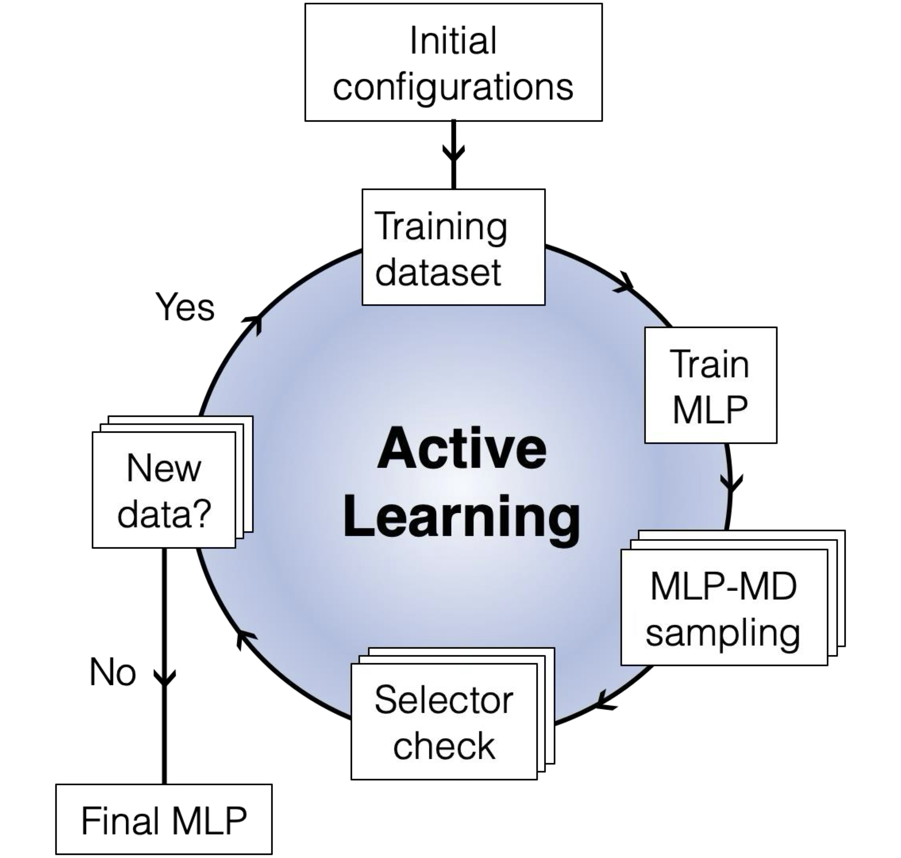

:orphan:

.. This page is orphan because it is the documentation entry point

mlp-train documentation
=======================

.. toctree::
   :maxdepth: 2
   :hidden:
   :caption: Documentation

   dev/installation
   dev/contributing
   references/index

.. toctree::
   :maxdepth: 2
   :hidden:
   :caption: Tutorials

   tutorials/tutorial1
   tutorials/tutorial2
   tutorials/tutorial3

.. toctree::
   :maxdepth: 2
   :hidden:
   :caption: Examples

   examples/example1
   examples/example2
   examples/example3

.. toctree::
   :maxdepth: 2
   :hidden:
   :caption: Citation

*mlp-train* is Python package for training machine learning based interatomic potential (MLIP) developed by Duarte group at the University of Oxford. It performs active learning (AL) loop to generate training data set, followed by training of selected MLIP.

|

.. note::

   This documentation is under development. Stay tuned for more functionalities!

