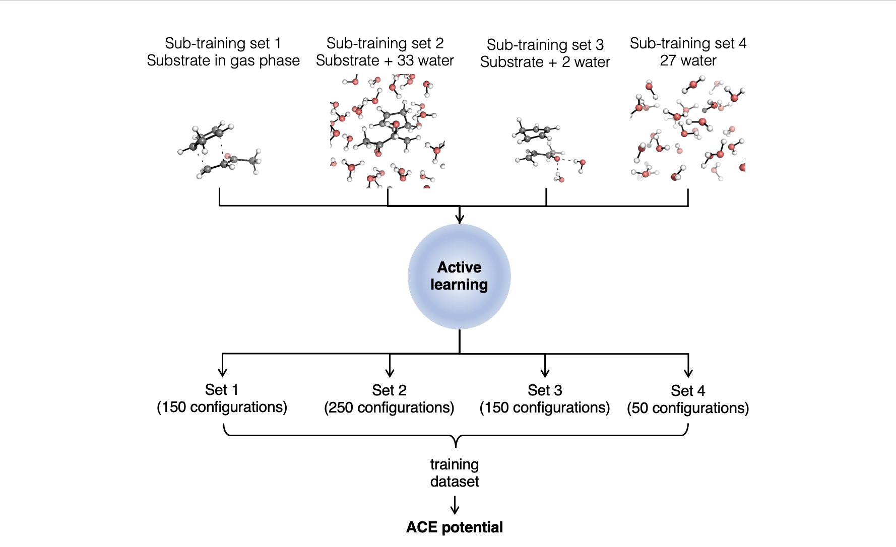

#  Modeling Chemical Processes in Explicit Solvents with Machine Learning Potential

This folder includes codes and starting files for various computational tasks related to the paper "Modeling Chemical Processes in Explicit Solvents with Machine Learning Potentials" (https://chemrxiv.org/engage/chemrxiv/article-details/64a8085fba3e99daefab8f89). These tasks include training implicit and explicit potentials, calculating 2D potential energy surfaces, 1D free energy surfaces, uphill dynamics, and downhill dynamics. 

Please note that due to the large size of the training and validation data, as well as the uphill and downhill trajectories, these data are not included in the GitHub repository, but can be downloaded from Oxford University Research Archive (ORA) (https://ora.ox.ac.uk/objects/uuid:68b9b398-e839-4683-a0b4-9e026b2408a2).

One of the objectives achieved in the paper is training a machine learning potential for the Diels-Alder reaction of CP and MVK in an explicit solvent. In order to illustrate the workflow of training such potentials, we provide an example using the endo reaction in explicit water:

For detailed code information, please refer to the file "endo_ace_ex.py" located in the "training/explicit" directory.
